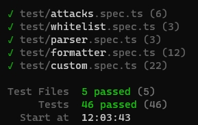

# @fn/xss

使用白名单指定的配置清理不受信任的 HTML（以防止 XSS）

基于 [js-xss](https://github.com/leizongmin/js-xss) `v1.0.15` 版本，功能上保持一致。

## 安装

在项目根目录下添加 `.npmrc` 文件，写入以下注册表指向：

```bash
@fn:registry=http://verdaccio.teiron-inc.cn:4873/
```

即可安装本包。

```bash
pnpm add @fn/xss
```

## 文档

See: [中文文档](https://github.com/leizongmin/js-xss/blob/v1.0.15/README.zh.md)

或者在 [assets](./assets) 目录下查看存档文档。

- 用法变化

请注意：该包的所有方法都变成独立导出，请按需导入，不再统一挂在某个大对象上。

```ts
// 按需导入
import { xss, getDefaultWhiteList, getDefaultCSSWhiteList } from '@fn/xss'

xss(htmlCode)
```

## 改动说明

相对原版，有以下改动：

- 不再有额外的依赖
- 更小的构建产物，输出的 JavaScript 文件从 50KB+ 降低至 16KB+
- 迁移至 TypeScript ，输出 CJS 和 ESM ，支持 ESM 的 Tree Shaking
- 更完善的 TS 类型提示

## 单元测试

原包已有的测试用例已全部验证通过。


